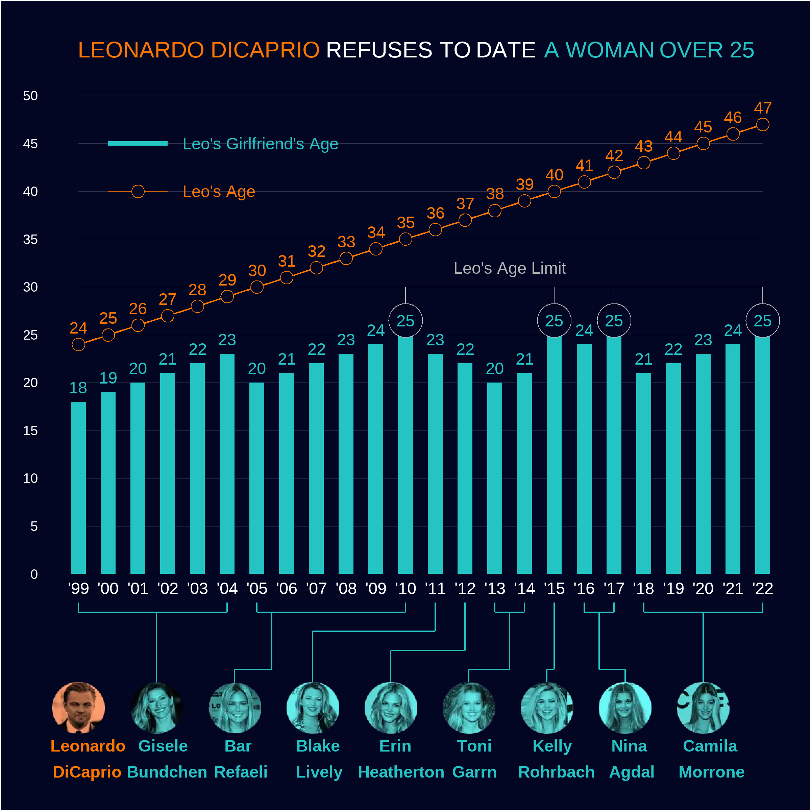
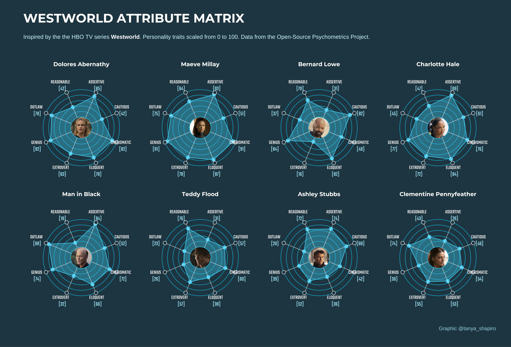
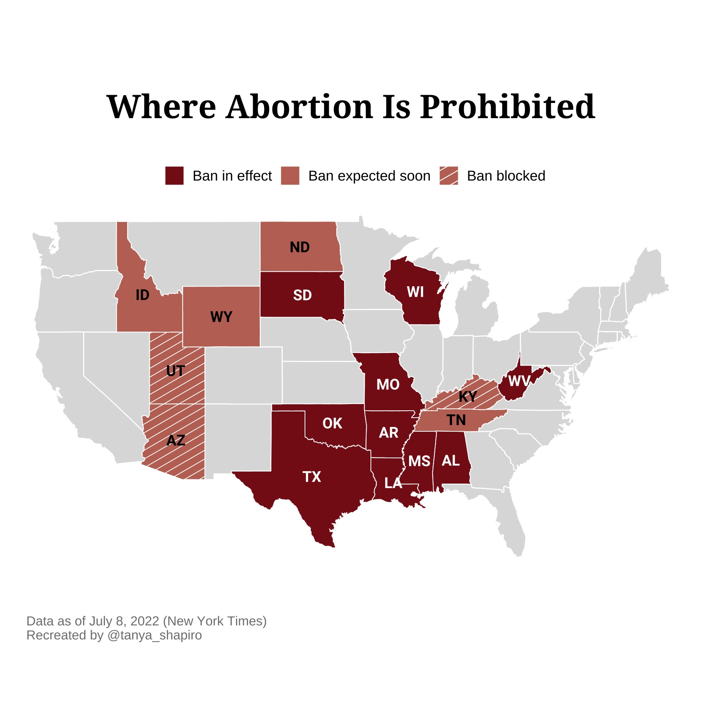
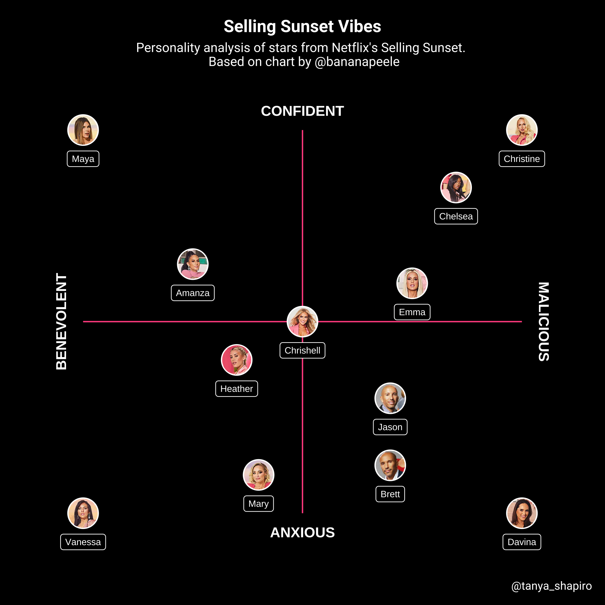
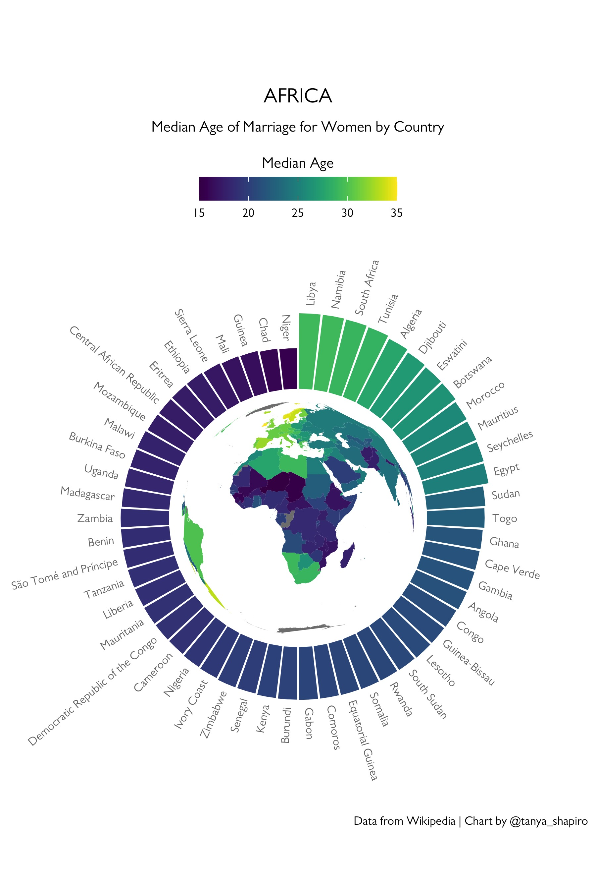

# Personal Data Visualization Projects

## Objective
This repo is dedicated to sharing my adventures with miscellaneous data visualization projects with others.

Most of my visualization work is coded with R, directories will include datasets and code files. Code files will include comments to walk through different steps of generating the visualiztion.

## Gallery

### [The Leo Chart](https://github.com/tashapiro/tanya-data-viz/blob/main/dicaprio-gfs/dicaprio-gfs.R)

Based on a chart found on [Reddit circa 2019](https://www.insider.com/leonardo-dicaprio-girlfriends-reddit-chart-2019-3). I wanted to recreate the infamous graphic using ggplot and related ggplot libarires in R. Images of Leo and his party of girlfriends taken from the original image. Code uses ggplot, ggtext, and ggimage.

### [Westworld Attribute Matrix](https://github.com/tashapiro/tanya-data-viz/blob/main/westworld/code/ww-radar-plot.R)
Inspired by the ["Attribute Matrix"](https://wwrp.fandom.com/wiki/Attribute_Matrix) show on the HBO series, Westworld. Data from the [Open-Source Psychometrics Project](https://openpsychometrics.org/). Plot created using **ggplot**, **ggtext**, and **ggimage**. 

### [NYT Times - Where Abortion Is Prohibited](https://github.com/tashapiro/tanya-data-viz/tree/main/nyt-abortion-map)
Attempt to recreate New York Times' abortion ban choropleth map using R (ggplot + ggpatern). The [original image](https://www.instagram.com/p/Cf1-6ifuGfR/) is from NYT's Instagram.

### [Selling Sunset](https://github.com/tashapiro/tanya-data-viz/blob/main/selling-sunset/selling-sunset.R)
Recreated the funny (and totally fictious) plot created by [@bananapeele](https://twitter.com/bananapeele/status/1517987473837674501?s=20&t=nIAvx3gUHxyEAMogmJUOdg).
&nbsp;

### [Globe Bar Plots](https://github.com/tashapiro/tanya-data-viz/tree/main/globe-bar-plot)

Inspiration for the Globe Bar plot came from [R Graph Gallery's tutorial](https://www.r-graph-gallery.com/circular-barplot.html) on circular bar plots. Used the tutorial to generate the bar plot, then overlayed a choropleth map (in the styel of a globe) in the center. Created using ggplot2.

